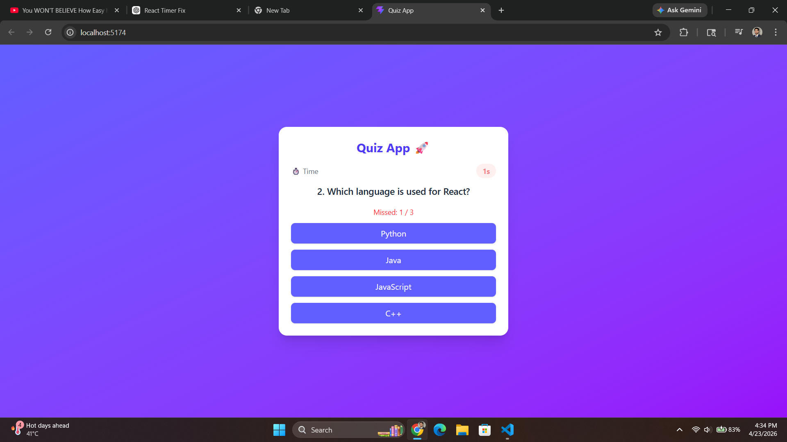
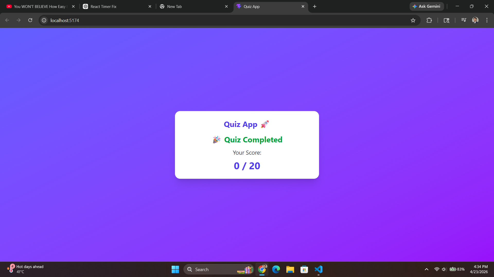

# 🎯 Quiz App (React + Tailwind CSS)

An interactive and responsive **Quiz Application** built using **React.js** and **Tailwind CSS**.
This app features a timer-based quiz system with smooth UI and real-time score tracking.

---

## 🚀 Features

* ⏱ **5 seconds per question**
* 🔄 Automatically moves to next question if time runs out
* ✅ Score tracking system
* ❌ Quiz ends after **3 consecutive unanswered questions**
* 🎨 Modern UI with Tailwind CSS
* ⚡ Smooth animations and responsive design
* 🏁 Final result screen

---

## 🛠 Tech Stack

* ⚛️ React.js
* 🎨 Tailwind CSS
* ⚡ Vite

---

## 📸 Screenshots

# 🎯 Quiz App (React + Tailwind CSS)

An interactive and responsive **Quiz Application** built using **React.js** and **Tailwind CSS**.
This app features a timer-based quiz system with smooth UI and real-time score tracking.

---

## 🚀 Features

* ⏱ **5 seconds per question**
* 🔄 Automatically moves to next question if time runs out
* ✅ Score tracking system
* ❌ Quiz ends after **3 consecutive unanswered questions**
* 🎨 Modern UI with Tailwind CSS
* ⚡ Smooth animations and responsive design
* 🏁 Final result screen

---

## 🛠 Tech Stack

* ⚛️ React.js
* 🎨 Tailwind CSS
* ⚡ Vite

---

## 📸 Screenshots

### 🧠 Quiz Screen



### 🎉 Result Screen



---

## 📂 Project Structure

```bash
src/
 ┣ Component/
 ┃ ┣ Questions.jsx
 ┃ ┣ Timer.jsx
 ┃ ┣ Result.jsx
 ┃ ┗ question.json
 ┣ App.jsx
 ┣ main.jsx
 ┗ index.css
```

---

## ⚙️ Installation & Setup

```bash
# Clone the repository
git clone https://github.com/varuncodev/Quiz-App.git

# Navigate into the project
cd Quiz-App

# Install dependencies
npm install

# Run the development server
npm run dev
```

---

## 🧠 How It Works

* Each question has a **5-second timer**
* If user selects an answer → next question
* If user does not answer → auto next
* After **3 consecutive skips → quiz ends**
* Final score is displayed at the end

---

## 🌟 Future Improvements

* 📊 Progress bar
* 🔊 Sound effects
* 🔁 Restart quiz button
* 🌐 Backend integration for dynamic questions

---

## 🤝 Contributing

Feel free to fork this project and improve it 🚀

---

## 📜 License

This project is open-source and available under the MIT License.

---

## 🙌 Author

Made with ❤️ by **Varun**

---

## 📂 Project Structure

```bash
src/
 ┣ Component/
 ┃ ┣ Questions.jsx
 ┃ ┣ Timer.jsx
 ┃ ┣ Result.jsx
 ┃ ┗ question.json
 ┣ App.jsx
 ┣ main.jsx
 ┗ index.css
```

---

## ⚙️ Installation & Setup

```bash
# Clone the repository
git clone https://github.com/varuncodev/Quiz-App.git

# Navigate into the project
cd Quiz-App

# Install dependencies
npm install

# Run the development server
npm run dev
```

---

## 🧠 How It Works

* Each question has a **5-second timer**
* If user selects an answer → next question
* If user does not answer → auto next
* After **3 consecutive skips → quiz ends**
* Final score is displayed at the end

---

## 🌟 Future Improvements

* 📊 Progress bar
* 🔊 Sound effects
* 🔁 Restart quiz button
* 🌐 Backend integration for dynamic questions

---

## 🤝 Contributing

Feel free to fork this project and improve it 🚀

---

## 📜 License

This project is open-source and available under the MIT License.

---

## 🙌 Author

Made with ❤️ by **Varun**
